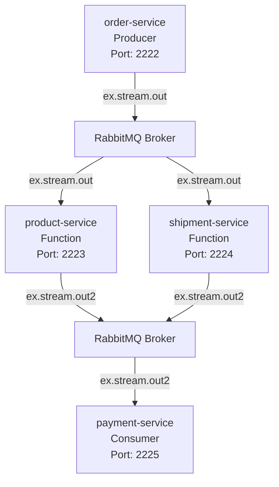

## Event driven microservices using Spring Cloud Stream and RabbitMQ [](https://twitter.com/piotr_minkowski)

[](https://circleci.com/gh/piomin/sample-spring-cloud-stream)

[](https://sonarcloud.io/dashboard?id=piomin_sample-spring-cloud-stream)
[](https://sonarcloud.io/dashboard?id=piomin_sample-spring-cloud-stream)
[](https://sonarcloud.io/dashboard?id=piomin_sample-spring-cloud-stream)
[](https://sonarcloud.io/dashboard?id=piomin_sample-spring-cloud-stream)

Detailed description can be found here: [Event driven microservices using Spring Cloud Stream and RabbitMQ](https://piotrminkowski.com/2017/02/13/event-driven-microservices-using-spring-cloud-stream-and-rabbitmq/) 

## Architecture Overview



#### 1. Order Service (Producer)
- **Purpose**: Generates sample orders automatically using a `Supplier<Order>` bean  
- **Default Port**: 2222  
- **Stream Role**: Producer (Supplier)  
- **Output Channel**: `ex.stream.out`  
- **Key Features**:
  - Automatically generates orders with incremental IDs every few seconds  
  - Creates orders with basic product names ("Example#2") and shipment types (SHIP)  
  - Demonstrates Spring Cloud Stream's reactive supplier pattern  
  - Acts as the data source for the entire pipeline  

#### 2. Product Service (Function/Processor)
- **Purpose**: Enriches orders with detailed product information and pricing  
- **Default Port**: 2223  
- **Stream Role**: Function (Processor)  
- **Input Channel**: `ex.stream.out` (group: product)  
- **Output Channel**: `ex.stream.out2`  
- **Key Features**:
  - Maintains a catalog of 4 predefined products with prices (100–1000)  
  - Matches incoming orders by product name and enriches with full product details  
  - Transforms orders by setting complete `Product` objects with pricing  
  - Forwards enriched orders to the next stage  

#### 3. Shipment Service (Function/Processor)
- **Purpose**: Enriches orders with detailed shipment information and pricing  
- **Default Port**: 2224  
- **Stream Role**: Function (Processor)  
- **Input Channel**: `ex.stream.out` (group: shipment)  
- **Output Channel**: `ex.stream.out2`  
- **Key Features**:
  - Maintains a catalog of 4 shipment types (`CAR`:50, `PLANE`:200, `SHIP`:100, `TRAIN`:20)  
  - Matches shipment types and enriches orders with pricing and delivery dates  
  - Processes orders in parallel with the product service  
  - Forwards enriched orders to payment processing  

#### 4. Payment Service (Consumer)
- **Purpose**: Aggregates enriched order data and calculates final totals  
- **Default Port**: 2225  
- **Stream Role**: Consumer  
- **Input Channel**: `ex.stream.out2` (group: payment)  
- **Key Features**:
  - Receives orders enriched by both product and shipment services  
  - Maintains internal order state to aggregate product and shipment information  
  - Calculates total order value (product price + shipment price)  
  - Demonstrates order aggregation pattern in distributed systems  
  - Final processing step that completes the order pipeline  

### Spring Cloud Stream Configuration

- **Spring Boot Version**: 3.5.0  
- **Java Version**: 21  
- **Binder**: RabbitMQ (`spring-cloud-stream-binder-rabbit`)  
- **Message Format**: JSON serialization of `Order` objects  
- **Functional Programming Model**: Uses `Supplier<Order>`, `Function<Order,Order>`, and `Consumer<Order>`  
- **Tracing**: Enabled with OpenTelemetry for observability  

#### Stream Destinations:
- **ex.stream.out**: Primary stream for initial order distribution  
- **ex.stream.out2**: Secondary stream for processed order aggregation  
- **Consumer Groups**: `product`, `shipment`, `payment` for load balancing  

#### Common Message Model (`sample-common` module):
- **Order**: id, type (PURCHASE/RETURN/EXCHANGE), status (NEW/PROCESSING/DONE/ERROR), timestamp, `Product`, `Shipment`  
- **Product**: id, name, price  
- **Shipment**: id, type (CAR/PLANE/SHIP/TRAIN), date, price  
- **Enums**: `OrderType`, `OrderStatus`, `ShipmentType`  

## How to Run the Applications

### Prerequisites
- Java 21+  
- Maven 3.6+  
- RabbitMQ (or Docker)  
- Docker (optional)

### Step 1: Start RabbitMQ Message Broker
#### Option A: Docker
```bash
docker run -d --name rabbitmq \
  -p 5672:5672 \
  -p 15672:15672 \
  rabbitmq:3-management
```
#### Option B: Local Installation
Ensure RabbitMQ is running on port 5672.

### Step 2: Build All Services
```bash
mvn clean install
```

### Step 3: Run Services
**Start order-service last to see full flow.**

#### A. Individual Services
```bash
cd product-service && mvn spring-boot:run
cd shipment-service && mvn spring-boot:run
cd payment-service && mvn spring-boot:run
cd order-service   && mvn spring-boot:run
```

#### B. Custom Ports
```bash
cd product-service && PORT=2223 mvn spring-boot:run
cd shipment-service && PORT=2224 mvn spring-boot:run
cd payment-service && PORT=2225 mvn spring-boot:run
cd order-service   && PORT=2222 mvn spring-boot:run
```

#### C. As JARs
```bash
mvn clean package
java -jar product-service/target/*.jar &
java -jar shipment-service/target/*.jar &
java -jar payment-service/target/*.jar &
java -jar order-service/target/*.jar &
```

### Step 4: Observe the Message Flow
Watch service logs for:
- **Order Service**: `INFO: Sending order: Order{…}`
- **Product Service**: `INFO: Processing order: Order{…}` / `INFO: Output order: Order{…}`
- **Shipment Service**: `INFO: Processing order: Order{…}` / `INFO: Output order: Order{…}`
- **Payment Service**: `INFO: Final response: <total>`

### Step 5: Monitor with RabbitMQ UI
Browse http://localhost:15672 (guest/guest) to inspect queues, exchanges, and consumers.

### Running Tests
```bash
mvn test
mvn test -pl payment-service
```

### Troubleshooting
- **RabbitMQ Connection**: `docker ps` / `docker logs rabbitmq`
- **Port Conflicts**: `lsof -i :2222`
- **Maven Issues**: `mvn dependency:purge-local-repository`
- **Message Flow**: Check bindings and service logs

### Understanding the Pipeline Pattern
- **Producer**: order-service  
- **Processors**: product-service, shipment-service  
- **Consumer**: payment-service  
- **Benefits**: Scalability, resilience, modularity, testability, observability  

> **Note:** If your Markdown renderer does not support Mermaid diagrams, please enable Mermaid support or view the diagram above as plain text.
